<div align="center">

# HIROKI TAJIMA

### Building proof-of-human systems, open tools, and visual experiments.

[](https://github.com/BBB-and-Company)
[](https://world.org/world-id)

</div>

## Contribution Breakout

<div align="center">
  
</div>

Every active contribution day becomes a brick. A luminous Orb clears the board, the paddle keeps the rally alive, and each impact flashes a verification mark. The deterministic animation is regenerated from live GitHub data every day.

## Currently Building

<table>
  <tr>
    <td width="50%" valign="top">
      <h3>🌌 Galaxy Collision</h3>
      <p>A real-time 60,000-particle galaxy collision in one HTML file. WebGL2, restricted N-body dynamics, and a physics regression harness—tuned to feel like Hubble imagery.</p>
      <p><a href="https://github.com/bbb-build/galaxy-collision-screensaver"><strong>Explore the simulation →</strong></a></p>
    </td>
    <td width="50%" valign="top">
      <h3>◎ MAScope MCP</h3>
      <p>An MCP server for World MiniApp reviews and analytics, powered by feedback from verified humans.</p>
      <p><a href="https://github.com/bbb-build/mascope-mcp"><strong>Explore the MCP server →</strong></a></p>
    </td>
  </tr>
</table>

```text
VERIFIED HUMANS  ───▶  WORLD MINIAPP SIGNALS  ───▶  AI / MCP ANALYTICS
       identity               feedback                    insight
```

## Build System

`TypeScript` · `Next.js` · `React` · `Supabase` · `Solidity` · `WebGL2` · `MCP`

<div align="center">

**Human × Orb × Code**

<sub>Build in public. Verify the signal. Ship what matters.</sub>

</div>
